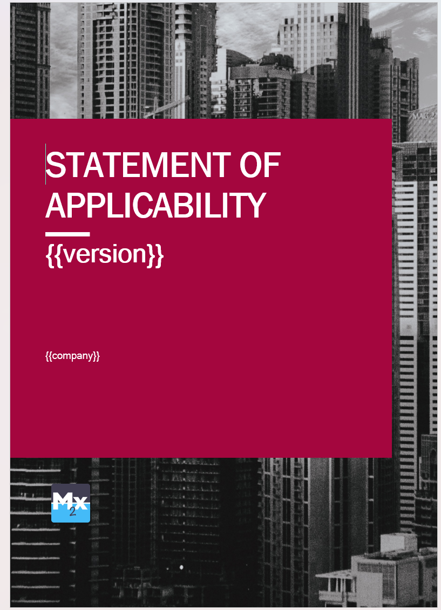
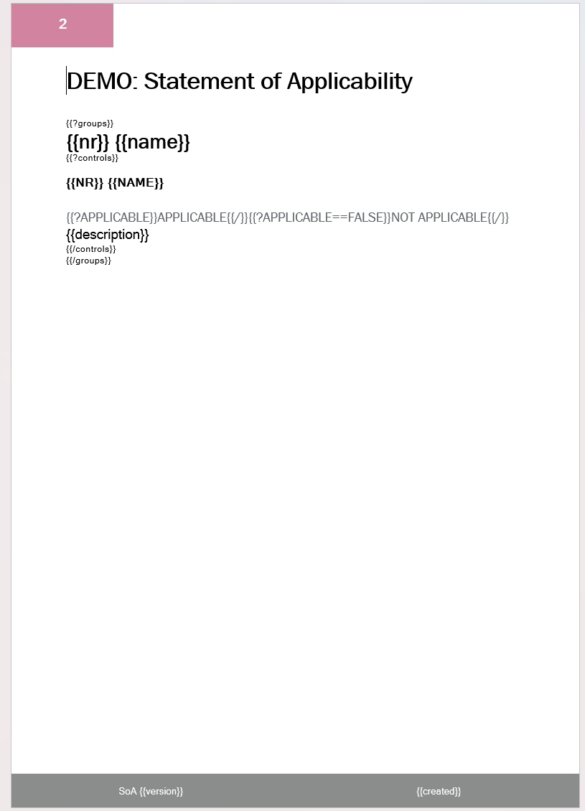
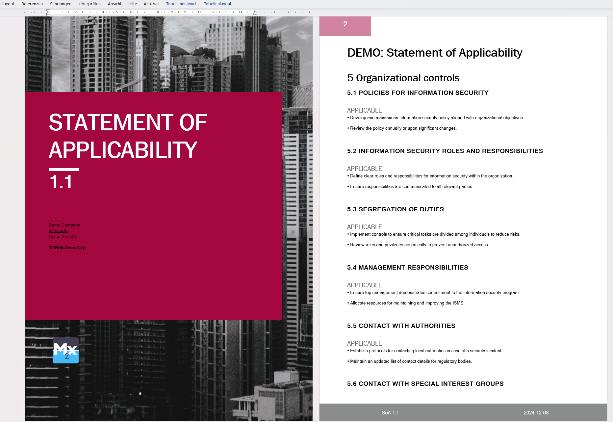
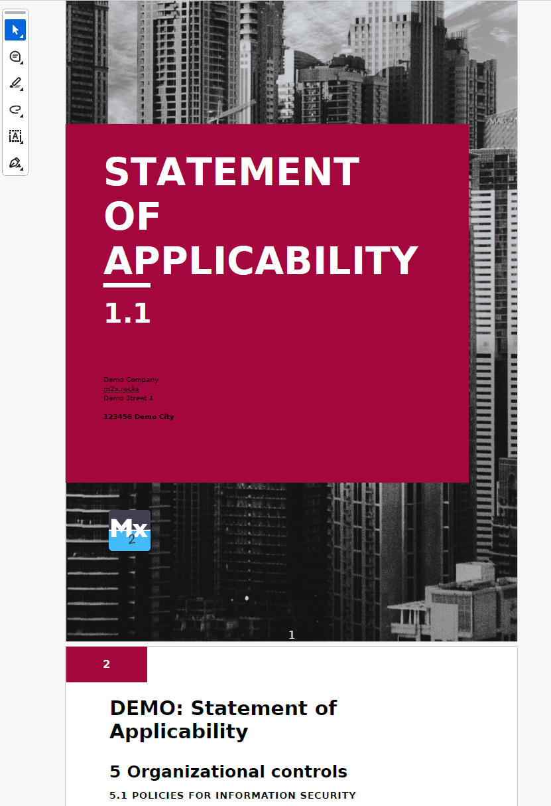
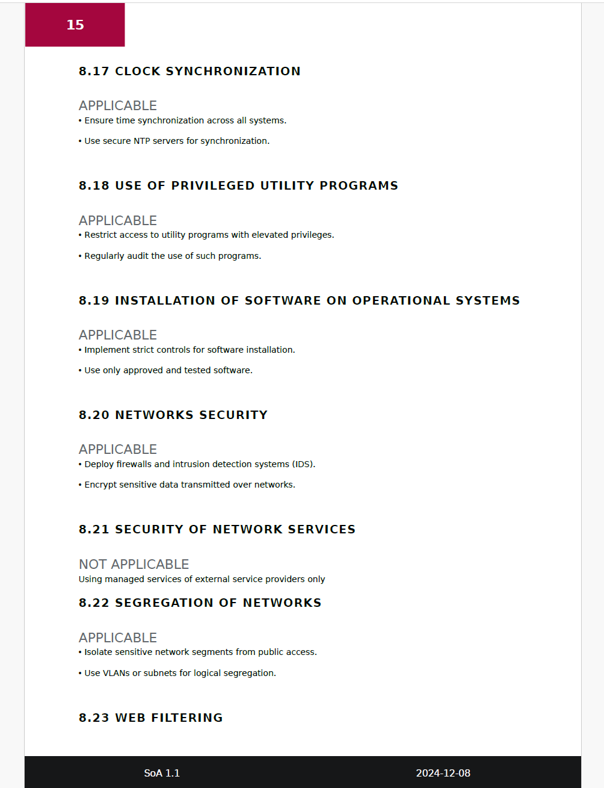
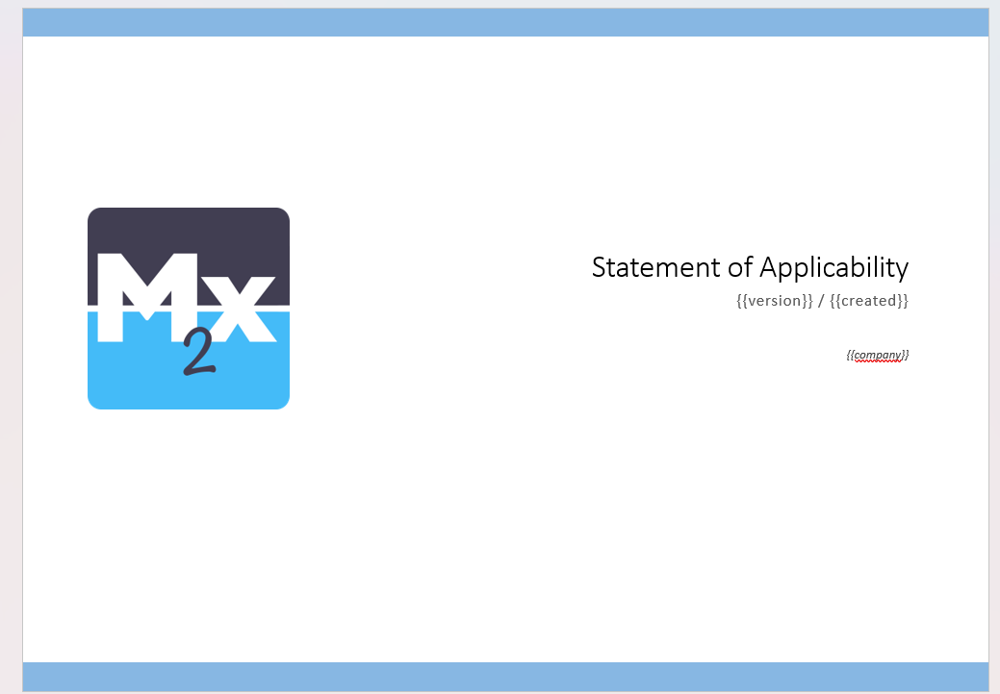
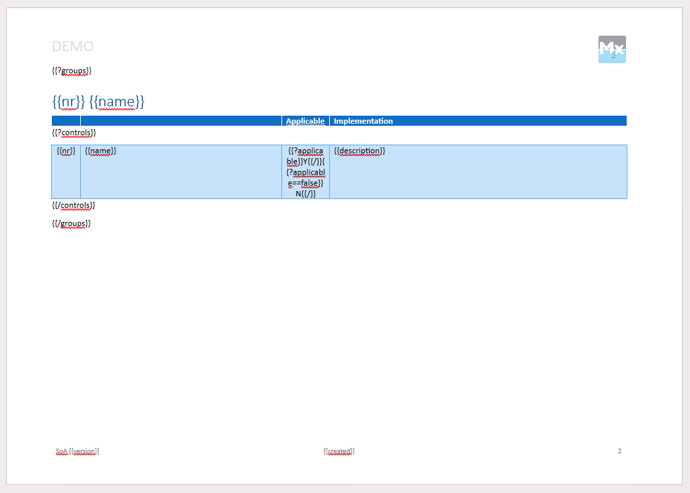
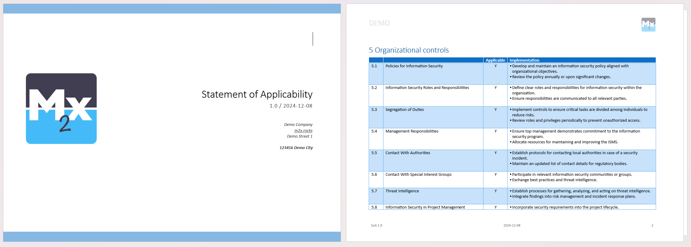
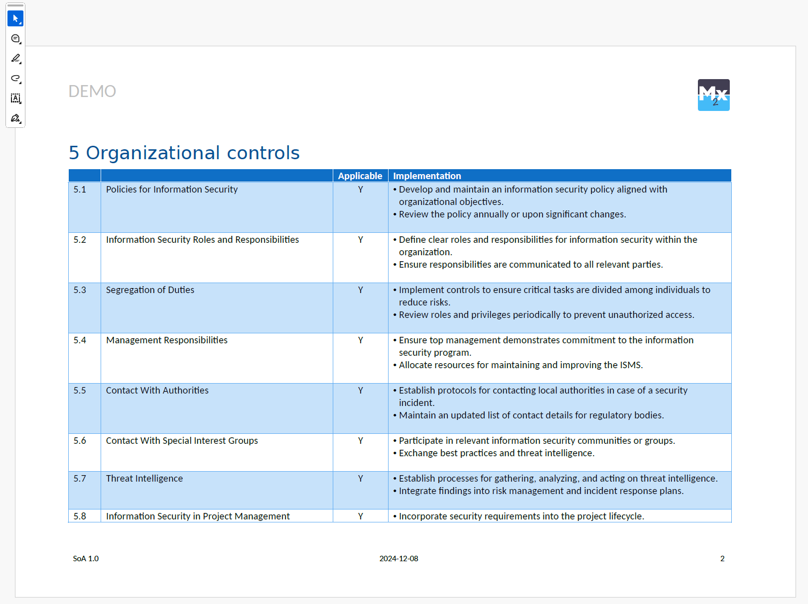

# Demo: Professional template based reports with poi-tl

## Intro

This demo shows, how to generate a professional, word template based, report with poi-tl.
In this use case it generates a **Statement of Applicability** (SoA) report how it is required by ISO 27001 (Information
security, cybersecurity and privacy protection).

> **IMPORTANT**: this is exemplary data generated with ChatGPT and is not a real world example of a SoA

For more details please read the related blog post:
[https://m2x.rocks/poi-tl-professionelle-berichte-aus-word-templates/](https://m2x.rocks/poi-tl-professionelle-berichte-aus-word-templates/)

## Demo

To show the capabilities of poi-tl, the report can be generated based on two different templates:

1. in portrait orientation as text report, based on an existing word template _Geschäftsbericht (Design 
   "Professionell")_ from Microsoft.
2. in landscape orientation as a compact table (build be myself).

The report is created as DOCX, but can also be converted into a PDF using a downstream process.
LibreOffice is used for this by default. When converting, it is not always guaranteed that the layout will be adopted
1:1.

Alternatively, Microsoft Office can also be used for conversion via Graph-APIThis will be absolutely identical to
to when you press export in Word itself. But this is not (yet?) implemented
(see [here](#microsoft-office-pdf-conversion)).

### Screenshots

#### Portrait

_Word Template_ - [src/main/resources/templates/template.docx](src/main/resources/templates/template.docx)

| Front Page                                                                                                                       | Other Pages                                                                                                        |
|----------------------------------------------------------------------------------------------------------------------------------|--------------------------------------------------------------------------------------------------------------------|
| [](example/template_portrait_frontpage.png) | [](example/template_portrait_page.png) |

_Rendered as DOCX_ - Full document: [example/portrait.docx](example/SoA_1.1_portrait.docx)

[](example/portrait_docx.png)

_Rendered as PDF_ - Full report: [example/portrait.pdf](example/SoA_1.1_portrait.pdf)

|                                                                                                           |                                                                                                         |
|-----------------------------------------------------------------------------------------------------------|---------------------------------------------------------------------------------------------------------|
| [](example/portrait_pdf.png) | [](example/portrait_pdf_2.png) |

#### Landscape

_Word Template_ - [src/main/resources/templates/template_table.docx](src/main/resources/templates/template_table.docx)

| Front Page                                                                                                                          | Other Pages                                                                                                |
|-------------------------------------------------------------------------------------------------------------------------------------|------------------------------------------------------------------------------------------------------------|
| [](example/template_landscape_frontpage.png) | [](example/template_landscape_page.png) |

_Rendered as DOCX_ - Full document: [example/landscape.docx](example/SoA_1.0_landscape.docx)

[](example/landscape_docx.png)

_Rendered as PDF_ - Full report: [example/landscape.pdf](example/SoA_1.0_landscape.pdf)

[](example/landscape_pdf.png)

---

## Want to try yourself?!

This application is a Spring Boot application and uses Docker.

Thanks to [moalhaddar/docx-to-pdf](https://github.com/moalhaddar/docx-to-pdf),
the docx to pdf conversion can be used very easily via REST-API.

[poi-tl](https://github.com/Sayi/poi-tl) makes it very easy to create Word documents, whereby templates are simply
filled with data.

### Run

Start with the following commands:

```shell
./mvnw spring-boot:run
```

or run the [DemoApplication](src/main/java/rocks/m2x/demo/DemoApplication.java) class in IDEA (you will need lombok
enabled).

### Usage

```http request
GET http://localhost:8080/api/soa/report
```

- docx: [http://localhost:8080/api/soa/report](http://localhost:8080/api/soa/report)
- pdf: [http://localhost:8080/api/soa/report?format=pdf](http://localhost:8080/api/soa/report?format=pdf)

Parameters:

- `format` (optional): `pdf` to convert the docx to pdf by libreoffice transformer (default).
- `download` (optional): `false` to stream the file as response instead of downloading it.

### Configuration

The configuration is done in the `application.properties` file.

For a full list of available options see
[ApplicationConfigurationProperties](src/main/java/rocks/m2x/demo/config/ApplicationConfigurationProperties.java).

E.g. to change the base template, set the `m2x.demo.export.template` property to the desired template file name.

```properties
# landscape as table
m2x.demo.export.template=classpath:/templates/template_table.docx
# portrait as text blocks
# m2x.demo.export.template=classpath:/templates/template.docx
```

Demo templates are located in the `src/main/resources/templates` folder.

### Microsoft Office PDF Conversion

**Prerequisites**: You need a Microsoft Office business tenant and admin account so that you can register an Azure App
in your Azure Portal and grant the required permissions.

**_Due to these requirements, implementation has not yet taken place._**
