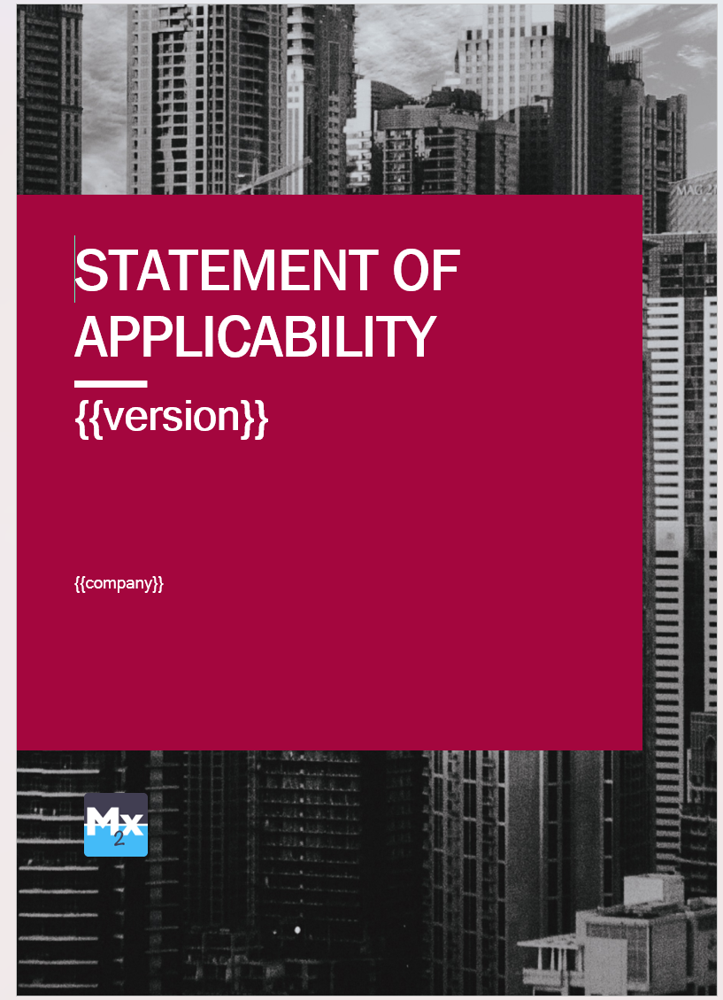
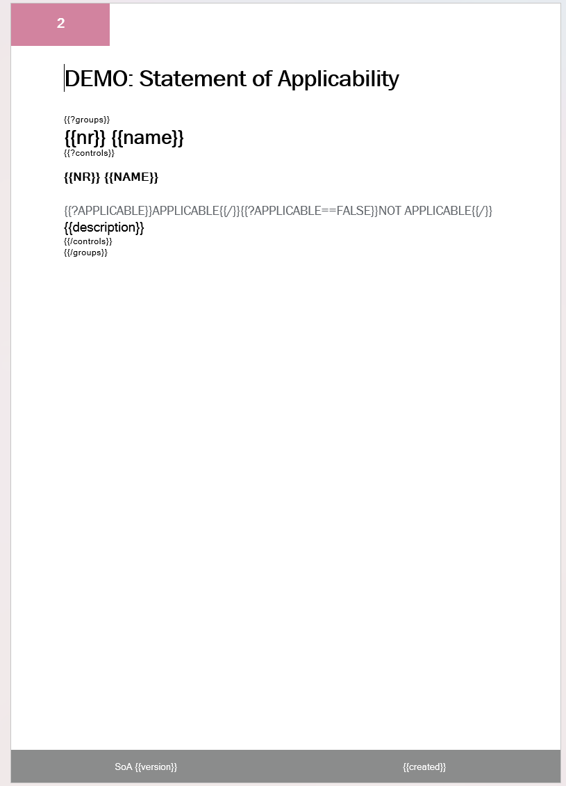
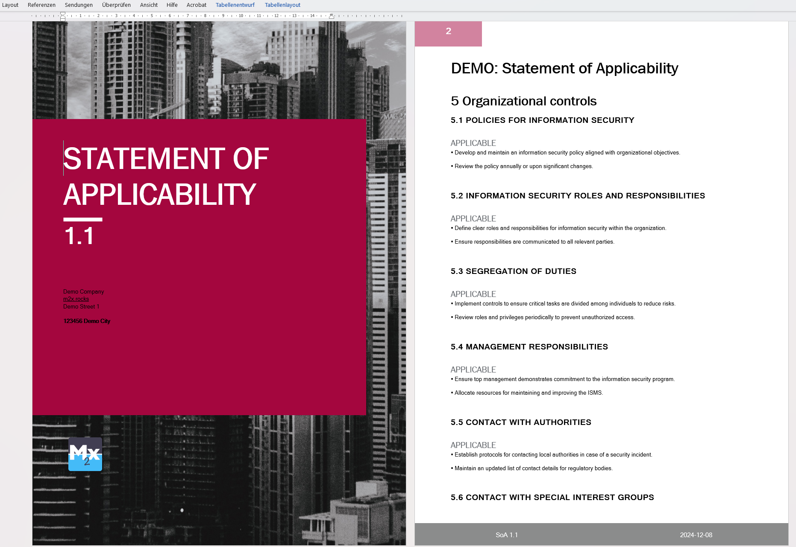
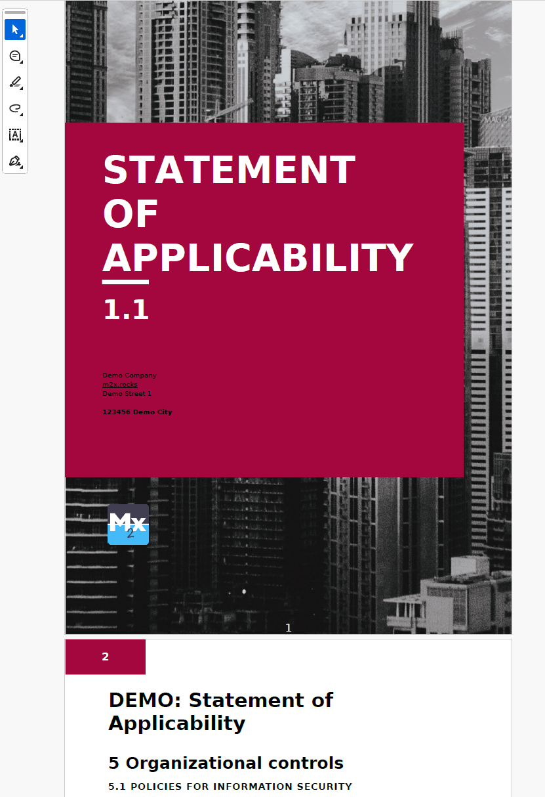
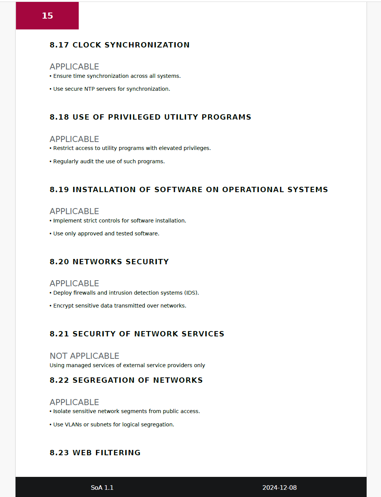
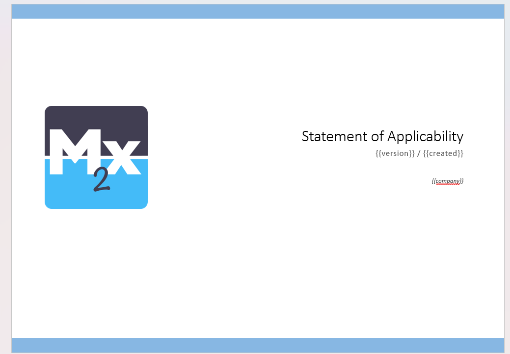
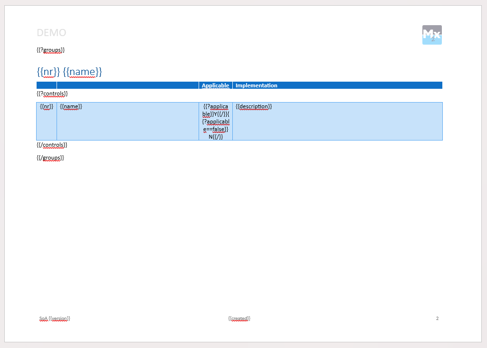
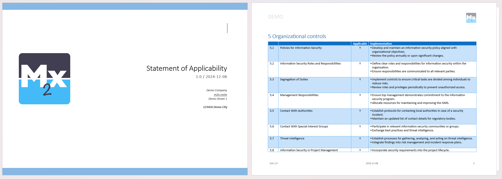
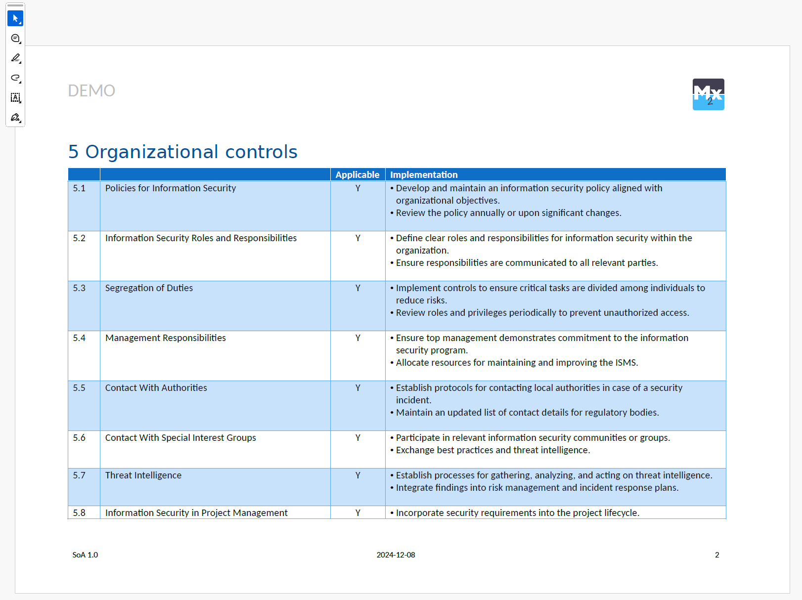

# Demo: Professional template based reports with poi-tl

## Intro

This demo shows how to generate professional Word template-based reports with poi-tl, using a **Statement of Applicability** (SoA) report for ISO 27001 as an example.

> **IMPORTANT**: This uses exemplary data generated with ChatGPT and is not a real-world example.

Related blog post: [https://m2x.rocks/poi-tl-professionelle-berichte-aus-word-templates/](https://m2x.rocks/poi-tl-professionelle-berichte-aus-word-templates/)

## Demo

The report can be generated using two templates:

1. **Portrait**: Text-based report using Microsoft's "Geschäftsbericht (Design Professionell)" template
2. **Landscape**: Compact table format

Reports are generated as DOCX and can be converted to PDF using LibreOffice (default). Layout may not be 1:1 identical. Microsoft Office conversion via Graph API is planned but not yet implemented (see [Microsoft Office PDF Conversion](#microsoft-office-pdf-conversion)).

### Screenshots

#### Portrait

_Word Template_ - [src/main/resources/templates/template.docx](src/main/resources/templates/template.docx)

| Front Page                                                                                                                       | Other Pages                                                                                                        |
|----------------------------------------------------------------------------------------------------------------------------------|--------------------------------------------------------------------------------------------------------------------|
| [](example/template_portrait_frontpage.png) | [](example/template_portrait_page.png) |

_Rendered as DOCX_ - Full document: [example/portrait.docx](example/SoA_1.1_portrait.docx)

[](example/portrait_docx.png)

_Rendered as PDF_ - Full report: [example/portrait.pdf](example/SoA_1.1_portrait.pdf)

|                                                                                                           |                                                                                                         |
|-----------------------------------------------------------------------------------------------------------|---------------------------------------------------------------------------------------------------------|
| [](example/portrait_pdf.png) | [](example/portrait_pdf_2.png) |

#### Landscape

_Word Template_ - [src/main/resources/templates/template_table.docx](src/main/resources/templates/template_table.docx)

| Front Page                                                                                                                          | Other Pages                                                                                                |
|-------------------------------------------------------------------------------------------------------------------------------------|------------------------------------------------------------------------------------------------------------|
| [](example/template_landscape_frontpage.png) | [](example/template_landscape_page.png) |

_Rendered as DOCX_ - Full document: [example/landscape.docx](example/SoA_1.0_landscape.docx)

[](example/landscape_docx.png)

_Rendered as PDF_ - Full report: [example/landscape.pdf](example/SoA_1.0_landscape.pdf)

[](example/landscape_pdf.png)

---

## Want to try yourself?!

This is a Spring Boot application that uses [poi-tl](https://github.com/Sayi/poi-tl) for Word document generation and [moalhaddar/docx-to-pdf](https://github.com/moalhaddar/docx-to-pdf) for PDF conversion via REST API.

### Run

```shell
./mvnw spring-boot:run
```

Or run the [DemoApplication](src/main/java/rocks/m2x/demo/DemoApplication.java) class in IDEA (requires Lombok enabled).

### Usage

```http request
GET http://localhost:8080/api/soa/report
```

- docx: [http://localhost:8080/api/soa/report](http://localhost:8080/api/soa/report)
- pdf: [http://localhost:8080/api/soa/report?format=pdf](http://localhost:8080/api/soa/report?format=pdf)

Parameters:

- `format` (optional): `pdf` to convert the docx to pdf by libreoffice transformer (default).
- `download` (optional): `false` to stream the file as response instead of downloading it.

### Configuration

Configuration is done in `application.properties`. For full options see [ApplicationConfigurationProperties](src/main/java/rocks/m2x/demo/config/ApplicationConfigurationProperties.java).

To change the template:

```properties
# landscape as table
m2x.demo.export.template=classpath:/templates/template_table.docx
# portrait as text blocks
# m2x.demo.export.template=classpath:/templates/template.docx
```

Templates are located in `src/main/resources/templates`.

### Microsoft Office PDF Conversion

> **Not yet implemented** - Requires Microsoft Office business tenant and Azure App registration.

To enable PDF conversion via OneDrive Graph API (when implemented):

```properties
m2x.demo.export.pdf-conversion.pdf-conversion=graph-api
m2x.demo.export.pdf-conversion.graph-api.tenant-id=
m2x.demo.export.pdf-conversion.graph-api.client-id=
m2x.demo.export.pdf-conversion.graph-api.client-secret=
m2x.demo.export.pdf-conversion.graph-api.user-principal-name-or-id=
```

---

## MCP Server Integration

This application includes an MCP (Model Context Protocol) server that enables AI agents (like Claude, GPT, or Cursor IDE) to generate professional DOCX/PDF reports using custom templates and structured data.

### Features

- **Generic Report Generation**: Generate reports from any template and data structure
- **Template Management**: Upload and manage templates dynamically
- **Data Validation**: Validate report data against template schemas
- **Multiple Formats**: Support for both DOCX and PDF output
- **HTML Rendering**: Configurable HTML rendering for specific fields
- **Document Options**: Read-only protection, draft watermarks, field updates

### MCP Tools

#### `generate_report`

Generate DOCX/PDF reports from structured data and templates.

**Parameters:**
- `templateId` (optional): Template identifier or path
- `templateContent` (optional): Base64 encoded .docx template
- `reportData` (required): JSON object matching template placeholders
- `outputFormat` (optional): "docx" or "pdf" (default: "docx")
- `options` (optional): Report options (readonly, draft, htmlFields)

#### `provide_template`

Upload a template for use in report generation.

**Parameters:**
- `templateName` (required): Template identifier
- `templateContent` (required): Base64 encoded .docx file
- `description` (optional): Template description

#### `validate_data`

Validate report data against template requirements.

**Parameters:**
- `templateId` (required): Template identifier
- `reportData` (required): JSON object to validate

#### `list_templates`

Get list of available templates with metadata.

### Template Placeholders

Use double curly braces for placeholders:
- Simple: `{{customerName}}`
- Nested: `{{customer.name}}`, `{{customer.address.city}}`
- Arrays: `{{items[0].description}}`, `{{items}}` (for loops)

To render HTML content, specify fields in the `htmlFields` option (comma-separated) with HTML tags: `<p>`, `<b>`, `<i>`, `<u>`, `<ul>`, `<ol>`, `<li>`, `<br/>`.

### MCP Resources

- `template://schema/{templateId}` - JSON Schema defining expected data structure
- `template://info/{templateId}` - Template metadata (name, description, version)
- `sample://data/{templateId}` - Example data structure for a template

### Transport & Configuration

**STDIO Transport** (for Claude Desktop, Cursor IDE):

```json
{
  "mcpServers": {
    "document-generator": {
      "command": "java",
      "args": ["-jar", "/path/to/app.jar"]
    }
  }
}
```

Or with Docker: use `"command": "docker", "args": ["run", "-i", "--rm", "ghcr.io/<owner>/<repo>:latest"]`

**HTTP/SSE Transport**: `http://localhost:8080/mcp/message` (JSON-RPC 2.0 over HTTP/SSE)

**For Cursor IDE** (when server is running on localhost:8080):

1. **Option 1: Project-specific configuration** (recommended)
   - Copy `.cursor/mcp.json.example` to `.cursor/mcp.json` in this project
   - Or create `.cursor/mcp.json` with the configuration below

2. **Option 2: Global configuration**
   - Create or update `~/.cursor/mcp.json` on your system

Configuration content:

```json
{
  "mcpServers": {
    "document-generator": {
      "url": "http://localhost:8080",
      "transport": "streamableHttp",
      "endpoint": "/mcp/message"
    }
  }
}
```

**Important**: 
- Make sure the Spring Boot application is running on `localhost:8080` before connecting
- After adding the configuration, restart Cursor IDE
- The MCP server tools (`generate_report`, `provide_template`, `validate_data`, `list_templates`) will be available in Cursor's AI chat

> **Note**: The server uses Streamable HTTP transport which is compatible with Cursor IDE. For CLI-based testing, use STDIO transport or the integration tests for HTTP endpoint validation.

### Docker Distribution

Docker images are automatically built and published to GitHub Container Registry (GHCR) via GitHub Actions:

```bash
docker pull ghcr.io/<owner>/<repo>:latest
docker run -p 8080:8080 ghcr.io/<owner>/<repo>:latest
```

Available tags: `latest`, `<version>`, `<sha>`

**Docker Compose** (includes PDF conversion service):

```bash
docker compose up -d
```

This starts both `docx2pdf` (port 7700) and `mcp-server` (port 8080). See [compose.yml](compose.yml) for details.

### Configuration

MCP server settings in `application.properties`:

```properties
m2x.demo.mcp.enabled=true
m2x.demo.mcp.stdio-enabled=true
m2x.demo.mcp.http-enabled=true
m2x.demo.mcp.http-path=/mcp/message
m2x.demo.mcp.max-template-size=10485760
m2x.demo.mcp.template-ttl=PT1H

# Spring AI MCP Server Configuration
spring.ai.mcp.server.enabled=true
spring.ai.mcp.server.type=SYNC
spring.ai.mcp.server.protocol=STREAMABLE
spring.ai.mcp.server.annotation-scanner.enabled=true
# Streamable HTTP endpoint configuration
spring.ai.mcp.server.streamable-http.mcp-endpoint=/mcp/message
```

### Testing

- **Health Check**: Test the application health endpoint using the Bruno collection: `bru run --env local requests/health/health-check.bru`
- **MCP Endpoints**: Use the integration tests (`McpHttpEndpointIntegrationTest`) or STDIO transport for testing MCP functionality. The HTTP/SSE endpoint requires SSE session handling and cannot be tested with simple HTTP clients.

### Security Considerations

- Template content validation prevents malicious .docx files
- File size limits for base64 template content (default: 10MB)
- Temporary file cleanup with configurable TTL (default: 1 hour)
- Path traversal protection in template source parameters
